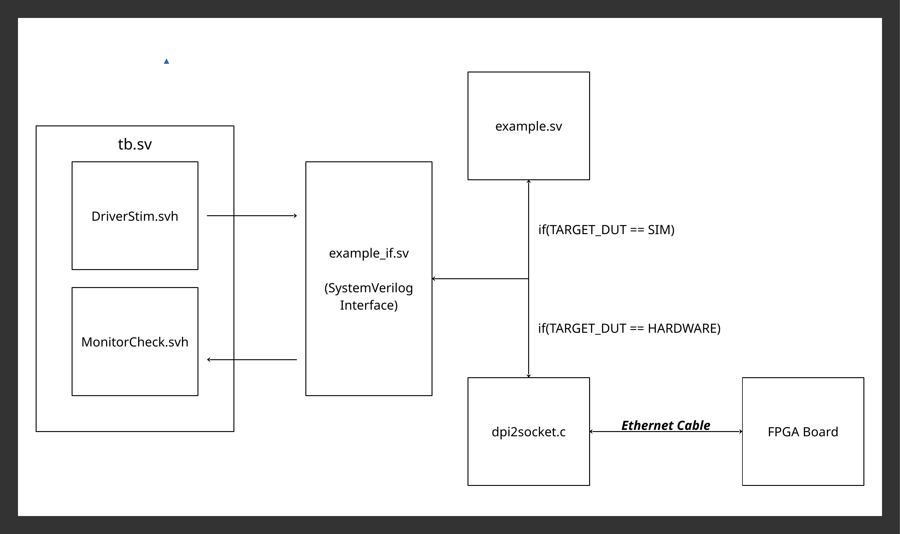
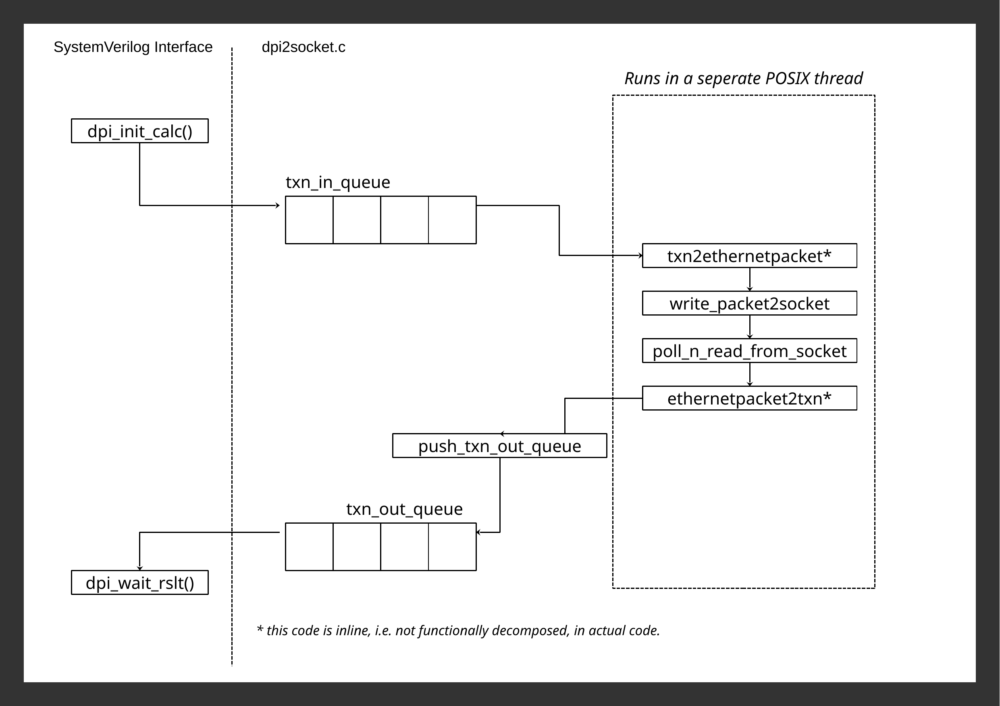

# Proof Of Concept: SystemVerilog Co-Emulation

Note that this repo is simply a Proof of Concept demonstration, the testbench is very bare bones,
and the hardware DUT is actually another computer(in my case an R-PI) listening on an ethernet port
and mimicking how the simple hardware would act. Spoofing the DUT in this way has no implications on 
the testbench code, as it's simply an opaque network socket form testbench perspective regardless.

## Value Proposition
This repo demonstrates that, utilizing SystemVerilog DPI, co-emulation testbenches (i.e. testbenches that
run the same tests for both RTL simulation & on-board hardware tests) can be easily written in pure
SystemVerilog.

This solves two main problems:
1. Duplicating testbench logic across simulation and hardware testbenches.
2. The need to introduce software scripting languages to your test code, for hardware tests (e.g. TCL, python).

The approach here is also seperated enough in it's architecture that it lends itself to
mostly parallel development of the test logic and the C-lang network code, where hypothetical
verification engineers and software engineers only need to agree on the dpi function signatures,
as the common API, minimizing communication overhead.

## Architecture
Delagating all DUT related code to the SystemVerilog interface
means that, through a simple macro parameter only utilized
within said interface, the underlying implementation of the
methods defined in the interface can change.

When in simulation mode, the interface implements it's functions
and tasks by interacting directly with the DUT.
While, when in hardware test mode, the interface implements
the functions through dpi calls, which themselves interact with
the DUT via a network socket (here presumed to be an ethernet cable)

dpi2socket.c contains:
1. Implementation of all dpi functions.
2. Linux socket api used to send raw packets over ethernet
3. Txn in and txn out queues

Essentially, when the testbench starts, dpi2socket sets up
a seperate pthread for the code which pushes to and polls from
the linux network socket.

This process polls the txn in queue and sends it's contents over
the network.
It then polls the socket, and on succesful read: pushes what
it has read to the txn out queue.

txn out queue is in turn polled by the system verilog interface.

## Build and run
TODO
